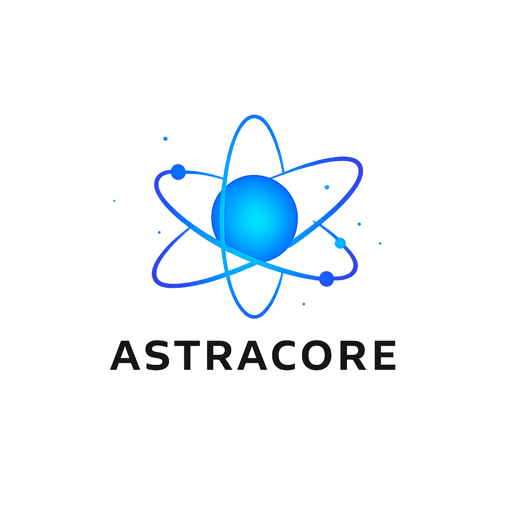

# 🚀 AstraCore

  

  
  
  

*AstraCore is a sci‑fi inspired homelab platform built on Proxmox and Docker, focused on virtualization, automation, and distributed systems.*

---

## 🧠 Overview

AstraCore is a multi-phase homelab project designed to evolve from a distributed, low-power cluster into a centralized, enterprise-style infrastructure. 

The project serves as both a learning platform and a production-style environment, enabling experimentation with modern infrastructure concepts such as virtualization, containerization, storage, and network architecture.

---

## ⚙️ Phase 1: Distributed Cluster

> **Status:** 🚧 *Actively being built, tested, and refined.* > *Active build and experimentation phase using modular, low-power hardware.*

### 🖥️ Infrastructure & Stack
- **Hardware:** 10-node ThinkCentre cluster (M73 / M93)
- **Virtualization:** Proxmox VE deployed across multiple nodes
- **Containers:** Docker workloads running within virtual machines
- **Storage:** TrueNAS (NFS)

### 🎯 Objectives & Features
- **Compute:** Distributed compute across multiple nodes with containerised workloads.
- **Access:** Reverse proxy for service exposure and VPN for secure remote management.
- **Goals:** Learn clustering concepts, build a flexible environment, and continuously optimize hardware.

### 📦 Hosted Services

*Core services running within AstraCore, categorized by function:*

| Category | Service | Description |
| :--- | :--- | :--- |
| **🌐 Networking & Security** | **AdGuard Home** **Traefik** **Cloudflare Tunnel** **WireGuard** **Authelia** | Network-wide DNS filtering & ad blocking Reverse proxy and dynamic routing Secure external access without port forwarding VPN for secure remote connectivity SSO / 2FA Authentication & access control |
| **🏠 Automation & IoT** | **Home Assistant OS** **TP-Link Tapo** | Smart home platform Device control and monitoring integration |
| **🎬 Media & Storage** | **Plex** **Sonarr / Radarr** **Prowlarr / Overseerr** **Immich** | Media streaming server Automated TV and Movie management Indexer management & media request system Self-hosted photo backup with AI/ML features |
| **📊 Monitoring & Dev** | **Portainer** **Grafana / Prometheus** **Uptime Kuma** **Gitea** | Container management UI Metrics collection, monitoring, and visualizations Service uptime monitoring Self-hosted Git service |
| **🤖 AI & Local LLM** | **Ollama** **Open WebUI** **pve-ai2** | Local LLM runtime Web interface for AI interaction *(planned 16GB RAM upgrade)* Secondary Ollama instance (dedicated AI node) |
| **🧰 Infrastructure & Utils** | **Proxmox Backup Server** **PostgreSQL** **qBittorrent / Recyclarr** **Rewards App** | VM and container backups Database backend Downloading & automated media quality management Internal/custom reward system |

---

## 🚧 Phase 2: AstraCore V2 

> **Status:** 📝 *Planned — transition will begin following relocation.* > *Full redesign transitioning to a centralized, rack-based architecture.*

### 🖥️ Planned Infrastructure & Architecture
- **Primary Compute:** Dell PowerEdge R610 running Proxmox VE
- **Storage:** Rack-mounted TrueNAS system (12-bay storage) providing shared ZFS-based storage
- **Networking:** Cisco 48-port managed switch & Sophos XG firewall
- **Workloads:** Docker workloads hosted within VMs, traffic routed via reverse proxy

### ⚡ Key Improvements & Goals
- **Consolidation:** Centralized compute replacing distributed, low-power nodes.
- **Networking:** Enterprise-grade security and VLAN segmentation (Servers, IoT, Guest, Management).
- **Resilience:** ZFS-based storage with high redundancy.
- **Efficiency:** Simplified power, cooling, and hardware management.
- **Outcome:** Transition from a learning cluster to a highly reliable, production-style homelab.

---

## 🔮 Project Vision

AstraCore represents a modular compute core, built to evolve over time.

The long-term goal is to create a scalable, stable, and high-performance homelab platform that mirrors real-world enterprise infrastructure while remaining flexible for ongoing experimentation and learning.

---

## 📡 Notes & Overall Status

- 🚧 **Phase 1:** In Development  
- ⏳ **Phase 2:** Planned  

*This project is continuously evolving as new hardware, tools, and ideas are introduced. Expect regular changes, improvements, and experimentation throughout its development.*
